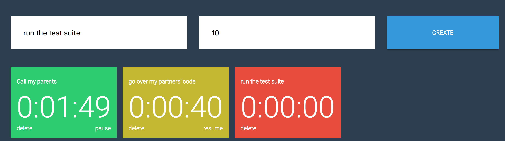

# \<timers-manager\>

Simple application to schedule and manage events

[](https://summerschool-polymer-timers.firebaseapp.com/)


Access the application [here](https://summerschool-polymer-timers.firebaseapp.com/)

Or clone the repo and follow these steps to build it:

## Install the Polymer-CLI

First, make sure you have the [Polymer CLI](https://www.npmjs.com/package/polymer-cli) installed. Then run `polymer serve` to serve your application locally.

## Viewing Your Application

```
$ polymer serve
```

## Building Your Application

```
$ polymer build
```

This will create builds of your application in the `build/` directory, optimized to be served in production. You can then serve the built versions by giving `polymer serve` a folder to serve from:

```
$ polymer serve build/es6-bundled
```

## Running Tests

```
$ polymer test
```

Your application is already set up to be tested via [web-component-tester](https://github.com/Polymer/web-component-tester). Run `polymer test` to run your application's test suite locally.
